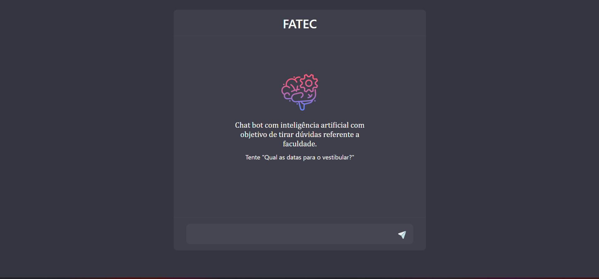
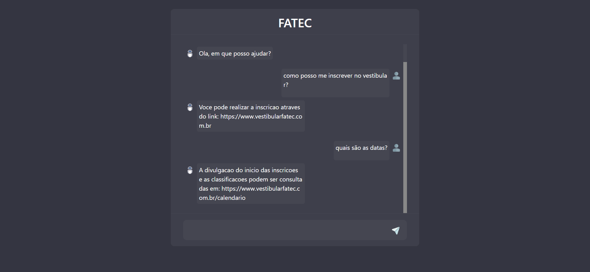

# Chatbot Fatec com IA

> Esse projeto foi desenvolvido utilizando angular. Para o funcionamento correto do projeto é necessário o download e a execução do projeto back-end que foi desenvolvido em python que tem como base IA para retornar as respostas;

Link para download do projeto backend: https://github.com/AlnDevE/chatbot-ia-api

## ⚙️ Funcionalidades

- [x] Responde dúvidas referente a faculdade de tecnologia.

## ⚙️ Funcionalidades Futuras

- [x] Interface para treinamento da IA. 

## 💻 Preview

    
    

## 💻 Development server

Antes de começar, verifique se você atendeu aos seguintes requisitos:

* Ter instalado o Node.

Após isso, execute o comando "npm i" no diretório raiz para instalar as dependências do projeto. Navegue até http://localhost:4200/. O aplicativo será recarregado automaticamente se você alterar qualquer um dos arquivos de origem.

[⬆ Voltar ao topo](#chatbot-ia-angular) 
